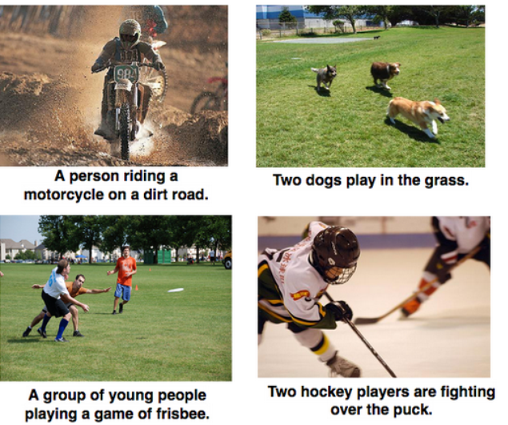

## Image_Captioning_using_Flickr_dataset
using flickr dataset ,pretrained inceptionv3 model, and lstms ,we implemented image captioning for automatically generating text from image
## Image Captioining
Automatically generating the textual description from an artificial system is the task of image captioning.
## Caption Images

## Dataset
Dataset Consists of 8091 image and each image has five captions.dataset is divided into two parts one is 7000 images for traiing and 1000 images for testing.

https://www.kaggle.com/adityajn105/flickr8k
